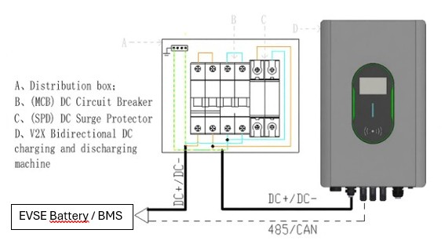
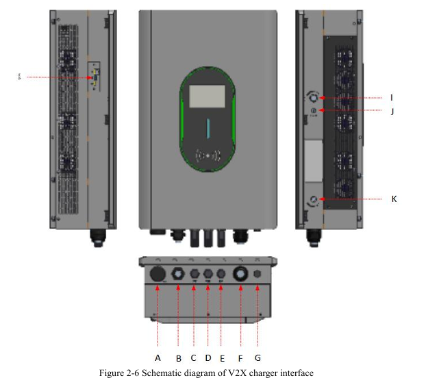

This page provides details about the 22/25Kw charger from UUGP (UBC22K1000-Y1-CCS2D).

The benefit of this charger is that it connects (power) directly to DC, and thus reduce the conversion loss.

The charger connects to the BMS using RS485, and to the DC power cables between the battery and the inverter.

The manual can be found here: https://github.com/JorgenSeemann/Battery-Emulator-Wiki/blob/main/docs/setup/chargers/V2X%20Bidirectional%20DCDC%20EV%20Charger%20User%20Manual%20V10_260918_123745.pdf

## Specs

EV Side DC:

* Rated power: 22kW
* EV side voltage range	Charging mode: 150VDC - 1000VDC（derating below 250Vdc; Discharge mode: 300VDC - 1000VDC)
* EV side current range	Charging mode: 0 - 88A; Discharge mode: 0 - 80A
* Voltage stabilization accuracy: ≤±0.5%
* Steady current accuracy: ≤±1%
* Current error	Charging mode: ≤±0.3A
* Voltage error	Charging mode: ≤±0.5%
* Current ripple Charging mode: ≤1.5A(10Hz), ≤6A(5KHz), ≤9A(150KHz)
* Input current overshoot: ≤110%

Bus Side DC:

* Voltage range: 350VDC - 980VDC (350 - 600VDC power down to 15kW)
* Current range: Charging mode: 0 - 40A; Discharge mode: 0 - 36.7A
* Rated power: 22kW

Environment:

* Working temperature: -40℃ to +5 ℃, rated usage is required for temperatures above 55℃
* Storage temperature: -40℃ to ＋85℃
* Relative humidity: ≤ 95% RH, no condensing
* Cooling method: Forced air cooling
* Altitude: 2000m, downgrading is required for use above 2000m
* Protection level: IP66
* Communication: CAN/RS485
* Charging interface: CCS2

The charger is controlled and monitored via RS485, or via it's local Web IO. 

# Setup

| Object | silk-screen | function | PIN |
|:------:|:------------|:---------|:----|
| A | WIFI/4G antenna | WIFI/4G antenna, built-in WIFI/4G module comes standard with WiFi and Bluetooth (two in one), 4G optional | / |
| B | DC incoming line | Connect the inverter DC bus input port, default is 2 meters | 3*10mm² |
| C | COM1 | Unused for communication with inverters based on Modbus RTU protocol (RS485) | 485A: 4 485B: 5 CANH: 3 CANL: 6 DSP-485A: 1 DSP-485B: 2 DSP-IN: 7 DSP-GND: 8 |
| D | COM2 | Used for reservation or merging | 485A: 4 485B: 5 CANH: 3 CANL: 6 DSP-485A: 1 DSP-485B: 2 DSP-IN: 7 DSP-GND: 8 |
| E | RJ45 | RJ45 wired network port | / |
| F | EV gun line | CCS2 DC Charging Cable | / |
| G | / | Vent valve | / |
| H | UI | RJ45 Ethernet port/capture message for retrieving charging logs | Ethernet port |
| H | APP | USB interface/program upgrade upgrades | USB port |
| H | SIM | 4G card socket/network connection | Insert 4G card |
| I | BLACK START | black start button | / |
| J | Type C | Black start external power bank power supply interface | / |
| K | Emergency stop button | Emergency stop | / |

